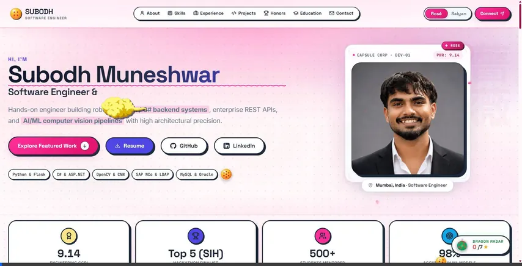

# Subodh Uttam Muneshwar - Engineering Portfolio

> Software Engineer | Backend Systems & AI/ML Pipelines | Python, C#/.NET, Flask, REST APIs  
> Mumbai, India | subodhum1603@gmail.com | +91 9029920228 | [LinkedIn](https://www.linkedin.com/in/subodh-muneshwar-47209324b/) | [GitHub](https://github.com/SubodhMuneshwar)

---

## Overview

This repository houses the source code for the personal engineering portfolio of **Subodh Uttam Muneshwar**, a Software Engineer specializing in backend infrastructure, REST API architecture, and computer vision deep learning pipelines.

The portfolio is built as a zero-dependency, high-performance web application utilizing modern Vanilla web standards. It combines a refined geometric interface with an interactive dual-aesthetic theme engine inspired by Dragon Ball mythology: **Super Saiyan Rose** (Light Mode) and **Planet Namek Super Saiyan** (Dark Mode).

---

## Interactive Preview

<p align="center">
  
</p>

> *Live demonstration showcasing the initial page entrance, one-by-one cascading scroll reveals across section headers and cards, and dynamic dual-theme switching.*

---

## Architectural Highlights

### 1. Zero-Dependency Vanilla Core
- **HTML5 Semantic Markup**: Accessible landmark hierarchy (`<header>`, `<main>`, `<section>`, `<article>`, `<footer>`) with descriptive ARIA attributes and a skip-to-content mechanism for keyboard and screen reader navigation.
- **Pure Vanilla CSS3 Design System**: Built on custom property design tokens (`css/tokens.css` and `css/styles.css`), eliminating framework overhead and achieving instant stylesheet parsing.
- **Modular JavaScript Engine**: ES6+ modules (`js/data.js`, `js/main.js`) separating portfolio content from rendering logic, interactive physics, and animation loops.

### 2. Kinetic Scroll-Triggered Reveal Engine
- **Sequential Cascading Entrances**: Elements animate into view sequentially rather than simultaneously as the user scrolls. Section headers (tag, title, description) and grid collections (skills, projects, achievements, timeline, contact cards) use dynamically calculated cubic-bezier stagger delays (`idx * 90ms`).
- **GPU-Accelerated Compositing**: All scroll entrance animations exclusively mutate `transform` (`translate3d` and `scale`) and `opacity`, ensuring steady 60fps and 120fps refresh rates without layout recalculations or paint invalidation.
- **Ambient Luminous Bloom**: Cards receive a subtle, hardware-accelerated ambient aura bloom upon reveal (Rosé pink in Light Mode, Golden Ki amber in Dark Mode) that smoothly settles into resting elevation shadows.
- **Automatic Resource Cleanup**: Observation hooks disconnect once triggered, and `will-change` hints are automatically purged 1100ms after entrance to preserve device memory.

### 3. Smooth Page Load Choreography & Lenis Momentum Scroll
- **Orchestrated Initial Landing**: Floating command header, hero kicker, title, role typography, call-to-action buttons, tech pills, HUD portrait frame, and hero stat cards cascade into place with fluid exponential deceleration curves (`cubic-bezier(0.16, 1, 0.3, 1)`).
- **Lenis Smooth Scrolling**: Powered by Studio Freight's Lenis library for normalized, fluid momentum scrolling across modern browsers and operating systems, with native touch passthrough on mobile devices.
- **FOUC Prevention**: Inline pre-paint script restores the user's theme selection from `localStorage` or matches the operating system's color scheme before first render, eliminating theme flickering.

### 4. Dual-Theme Engine & Real-Time System Synchronization
- **Super Saiyan Rose Mode (Light Mode)**: Clean porcelain canvas (`#FDFBFC`), tactile borders (`#E2D9E2`), and luminous deep rose accents (`#FF2E97`, `#E0116B`, `#7209B7`).
- **Planet Namek Super Saiyan Mode (Dark Mode)**: Deep cataclysmic obsidian canvas (`#070F0B`, `#0D1914`), golden amber glow (`#F59E0B`), and emerald Ki highlights (`#10B981`).
- **Real-Time OS Synchronization**: Dynamically listens for changes via `window.matchMedia('(prefers-color-scheme: dark)')` and updates active themes automatically when no explicit manual override is locked in `localStorage`.
- **Transformation Cutscene**: Seamless transition utilizing a dedicated video overlay and canvas-based lightning engine.

### 5. Interactive Gamified Features
- **Capsule Corp Scouter HUD**: Interactive power level telemetry readout and status monitoring card.
- **7 Collectible Dragon Balls & Dragon Radar**: Interactive search engine across the DOM, complete with a live radar HUD tracker and Shenron summon modal upon completion.
- **Flying Nimbus Controller**: Interactive cloud sprite with physics-based drag controls and turbo acceleration.
- **Interactive Card Physics**: Multi-card 3D perspective tilt, spotlight cursor tracking, magnetic button pull, and canvas confetti bursts.

---

## Performance & Accessibility Standards

- **WCAG 2.1 Level AA Compliance**: Contrast ratios verified across both Rosé Light and Saiyan Dark themes.
- **Reduced Motion Support**: Honors `prefers-reduced-motion: reduce` by disabling non-essential parallax, tilt, confetti, and transitions, reverting elements to stable static presentation.
- **Responsive Layout**: Fluid breakpoints covering compact mobile devices (320px), standard tablets (768px), laptops (1024px), and ultra-wide displays (1440px+).
- **Asset Optimization**: High-priority portrait preloading (`fetchpriority="high"`), lazy-loaded project preview media, and SVG-based vector icons powered by Lucide.

---

## Repository Structure

```
Portfolio/
├── assets/                          # Images, SVGs, documents, and media assets
│   ├── preview.webp                 # Animated preview showcasing site interactions
│   ├── subodh.jpg                   # High-resolution profile portrait
│   ├── Subodh_Muneshwar_ATS_Resume.pdf # Downloadable ATS-compliant resume
│   ├── saiyan.mp4                   # Transformation cutscene video
│   ├── shenron.mp4                  # Shenron summon cutscene video
│   └── project-*.svg                # Custom technical project illustrations
├── css/
│   ├── tokens.css                   # Design tokens, color palettes, and theme variables
│   └── styles.css                   # Complete component, layout, and animation styles
├── js/
│   ├── data.js                      # Centralized data model (projects, experience, skills)
│   └── main.js                      # Application controller, animations, and interaction engines
├── index.html                       # Semantic HTML5 application entry point
├── .gitignore                       # Git ignore configuration
└── README.md                        # Project documentation and engineering overview
```

---

## Getting Started

### Prerequisites
A modern web browser supporting ES6 JavaScript, CSS Custom Properties, and the HTML5 Canvas API (Google Chrome, Mozilla Firefox, Microsoft Edge, or Apple Safari).

### Local Execution

This project requires no build pipeline, npm installs, or transpilation steps. You can serve the project using any standard HTTP server:

#### Using Python 3:
```bash
# Start server from the workspace root
python -m http.server 3000
```
Then navigate to `http://localhost:3000/` in your browser.

#### Using Node.js (npx):
```bash
npx serve .
```

#### Using VS Code Live Server:
Right-click [index.html](file:///c:/Users/DELL/Desktop/Portfolio/index.html) and select **Open with Live Server**.

---

## Deployment

The portfolio is structured for direct static hosting with zero server configuration:

- **GitHub Pages**: Configured via Settings > Pages > Deploy from branch (`main` / root).
- **Vercel**: Deploy via command line using `vercel --prod` or link the GitHub repository.
- **Netlify**: Deploy via `netlify deploy --prod --dir=.` or drag-and-drop the directory.

---

## Author Profile

**Subodh Uttam Muneshwar**  
Software Engineer & Backend / AI-ML Developer  
- **Education**: Bachelor of Engineering in Computer Engineering (CGPI: 9.14)
- **Achievements**: Smart India Hackathon Top 5 Finalist; Mentored 500+ students in algorithms and programming.
- **Core Competencies**: Python, C#/.NET, Flask, REST APIs, OpenCV, Deep Learning (CNNs), MySQL, Oracle, SAP NCo Integration, RBAC/LDAP Authentication.
- **Portfolio Repository**: [SubodhMuneshwar/Portfolio-website](https://github.com/SubodhMuneshwar/Portfolio-website)

---

## License

This project is licensed under the MIT License - see the LICENSE file for details.
